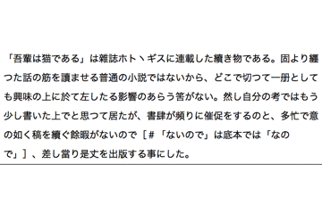

ConvertPunctuationMarks
====

日本語の句読点(、。)を英語の(，．)に変換します．
英語から日本語もあります．

# Description
Automatorを利用した，句読点変換サービスです．
資料からコピペしたいけど，句読点を置換するのが面倒というときに．

# Demo

# Requirement
Mac OS

# Install
1. ダウンロード後，.workflowファイルを開きます．
1. 「サービスをインストールしますか?」と表示されるので，インストールを選びます．
1. すると，メニューバーの(開いているアプリ名)のサービスにインストールしたやつが追加されます．

# Usage

1. テキストを選択します．
1. 本サービスを起動します．
1. テキストの句読点が置換されます．

システム環境設定のキーボード/ショートカット/サービスからショートカットを追加すると楽です．

# Licence

[MIT](https://github.com/tcnksm/tool/blob/master/LICENCE)

# Author

[ryoto7ishikawa](https://github.com/ryoto7ishikawa)
